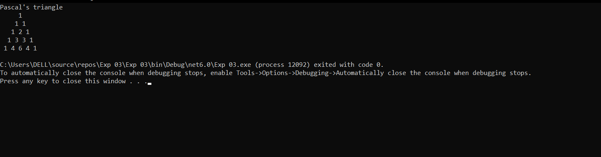

# Pattern

## Aim:
To write a C# program for a pascal's triangle.

## Equipment Required:
Online C# Compiler or visual studio

## Algorithm:
### Step 1:  
Initialize the necessary attributes.

### Step 2:
Get the limit from the user.

### Step 3:
using for loop print the rows and columns and space.

### Step 4:
Check the first and last rows of the triange is 1 using if condition.

### Step 5:
Otherwise use else to print the inner value  
val = val * (i - j + 1) / j;

### Step 6:
Display the program.

## Program:
```
Developed by : Kiran J
Ref no : 212221240022
```
```python
using System;
namespace PascalTriangleDemo
{
    class Example
    {
        public static void Main()
        {
            int rows = 5, val = 1, blank, i, j;
            Console.WriteLine("Pascal's triangle");
            for (i = 0; i < rows; i++)
            {
                for (blank = 1; blank <= rows - i; blank++)
                    Console.Write(" ");
                for (j = 0; j <= i; j++)
                {
                    if (j == 0 || i == 0)
                        val = 1;
                    else
                        val = val * (i - j + 1) / j;
                    Console.Write(val + " ");
                }
                Console.WriteLine();
            }
        }
    }
}
```

## Output:

## Result:
Thus,To write a C# program for a pascal's triangle is written and executed.
